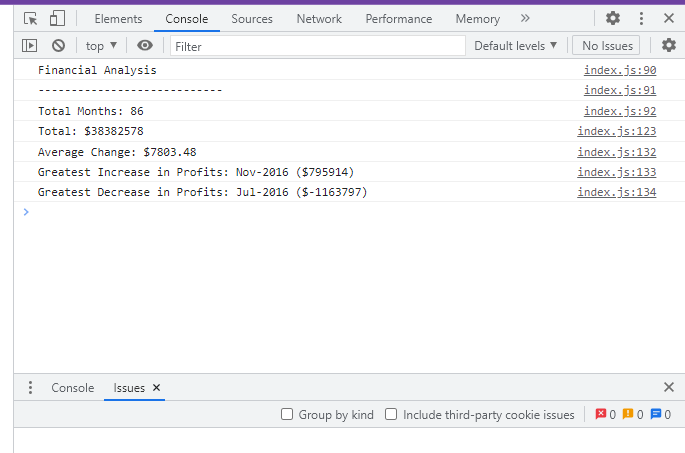

# Console-Finances

## Description
Analysed the financial records provided with a financial dataset by calculating total number of months, net total amount of Profit/Losses over the entire period, average of the changes in Profit/Losses over the entire period, greatest increase in profits and greatest decrease in losses over the entire period.

# Deployed Link:

# Repository Link:
https://github.com/Kalpana-Sivaprakash/Console-Finances

## Installation
N/A

## Usage  
This code is used in analyzing the financial records of a company like net total amount, Profit and Losses with Javascript.

## Credits
N/A

## License
MIT license

## Features
N/A

## Contributing
N/A
